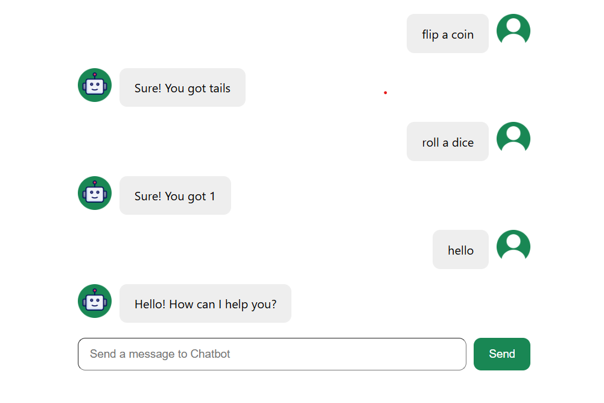

# 🤖 Chatbot Project (React + Vite)

A simple and clean chatbot interface built using **React**, **Vite**, and a mock chatbot API (`supersimpledev`).  
The chatbot supports user messages, bot responses, auto-scrolling, and message avatars.

---

## 📂 Project Structure

chatbot-project/
│
├── public/
├── src/
│ ├── assets/
│ │ ├── react.svg
│ │ ├── robot.png
│ │ └── user.png
│ │
│ ├── components/
│ │ ├── ChatInput.jsx
│ │ ├── ChatInput.css
│ │ ├── ChatMessage.jsx
│ │ ├── ChatMessage.css
│ │ ├── ChatMessages.jsx
│ │ ├── ChatMessages.css
│ │
│ ├── App.jsx
│ ├── App.css
│ ├── main.jsx
│ ├── index.css
│
├── index.html
├── package.json
├── vite.config.js
└── README.md

markdown
Copy code

---

## ✨ Features

- 💬 **Send and display chat messages**
- 🤖 **Automated chatbot response** using `Chatbot.getResponse()`
- 👤 **User and robot avatars**
- 📜 **Auto-scroll to latest message**
- ⚡ Built with **React + Vite** for fast development
- 🎨 Separate CSS files for each component

---

## 🧩 Components Overview

### **ChatInput**
- Text input + Send button
- Adds user message to chat
- Gets bot response from `supersimpledev`

### **ChatMessage**
- Renders a single message
- Shows different styles for `user` and `robot`
- Displays correct avatar

### **ChatMessages**
- Maps through message list
- Auto-scrolls using `useRef` + `useEffect`

### **App**
- Holds chat state
- Renders message list and input area

---

## 🚀 Getting Started

### 1️⃣ Clone the repository

```sh
git clone https://github.com/your-username/chatbot-project.git
cd chatbot-project
2️⃣ Install dependencies
sh
Copy code
npm install
3️⃣ Run the development server
sh
Copy code
npm run dev
4️⃣ Open in browser
Visit:

arduino
Copy code
http://localhost:5173
🖼️ Screenshots
Add your screenshots here — example:

css
Copy code

🛠️ Technologies Used
React

Vite

JavaScript (ES6)

CSS

supersimpledev Chatbot API

📦 Build for Production
sh
Copy code
npm run build
🤝 Contributing
Pull requests are welcome!
Feel free to open issues for improvements or bug reports.

📜 License
This project is licensed under the MIT License.
